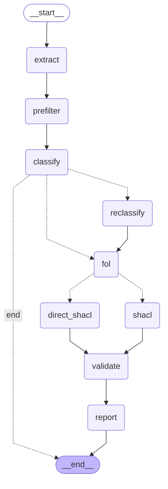

# PolicyChecker - LangGraph Architecture

Welcome to the **PolicyChecker** backend! 
This document serves as an onboarding guide for developers and interns to understand how our institution rule extraction engine is built.

We've moved away from a procedural script-based approach to a fully robust, stateful **Agentic LangGraph architecture**. This enables powerful node modularity, explicit conditional routing (e.g., fallback pathways), and seamless state injection.

## 🗺️ State Graph Diagram

Our pipeline defines the exact path a PDF takes to become SHACL shapes.

## 🧠 The State (`state.py`)

LangGraph operates by passing a global piece of state through every node. Our state is defined as `PipelineState` (TypedDict) and holds metrics like:
- `extracted_sentences`: Standard text parsed out from PDF.
- `rules`: Candidate rules isolated through heuristics and the LLM.
- `fol_formulas`: Output of First-Order Logic translation.
- `shacl_shapes`: Syntax-validated RDF shapes defining the rules.

> [!NOTE]
> When modifying a node, remember you must return a dictionary updating the slice of state you just operated on!

## 🔧 Node Walkthrough

| Node | File | Description |
|---|---|---|
| **extract** | `extract.py` | Uses `pdfplumber` to ingest PDFs and slice them into structured sentences. |
| **prefilter** | `prefilter.py` | Heuristically filters non-policy sentences (short titles, simple lists, generic data) out. |
| **classify** | `classify.py` | LLM evaluates if the sentence is a strict Institutional Rule, and what type (Obligation, Permission, Prohibition). |
| **reclassify** | `reclassify.py` | *Conditional Node*: A second-opinion LLM steps in if the first one is "uncertain". |
| **fol** | `fol.py` | Transforms isolated rules into First Order Logic formats. |
| **shacl** | `shacl.py` | Translates formal logic into structural SHACL `NodeShapes`. |
| **direct_shacl** | `direct_shacl.py` | *Fallback Node*: Directly instructs the LLM to output basic SHACL if the FOL generation step throws an error natively. |
| **validate** | `validate.py` | Pipes SHACL and ontology through `pyshacl` to ensure correctness against valid test student graphs. |
| **report** | `report.py` | Compiles academic metrics. |

## 🔀 Edge Routing Logic
There are two major conditional paths logic gates (`edges/`):
1. `route_classify`: Defers uncertain rules to the `reclassify` step, otherwise pushes straightforward rules to `fol`. If no rules are found at all, it jumps right to `__end__`.
2. `route_fol`: Inspects the output of the FOL node. If rules catastrophically failed formalization, it pushes them through the `direct_shacl_node` natural language fallback branch. 

## 💾 Caching Subsystem (`core/llm_cache.py`)
LLMs are slow and expensive, especially when iterating on node connections. We baked in an SQLite caching mechanism that seamlessly intercepts repetitive LLM calls inside `llm.py` and returns deterministic generation results. 
If you want force a clean slate from your LLMs (e.g. prompt tuning), simply delete:
`Remove-Item cache\llm_cache.db`
